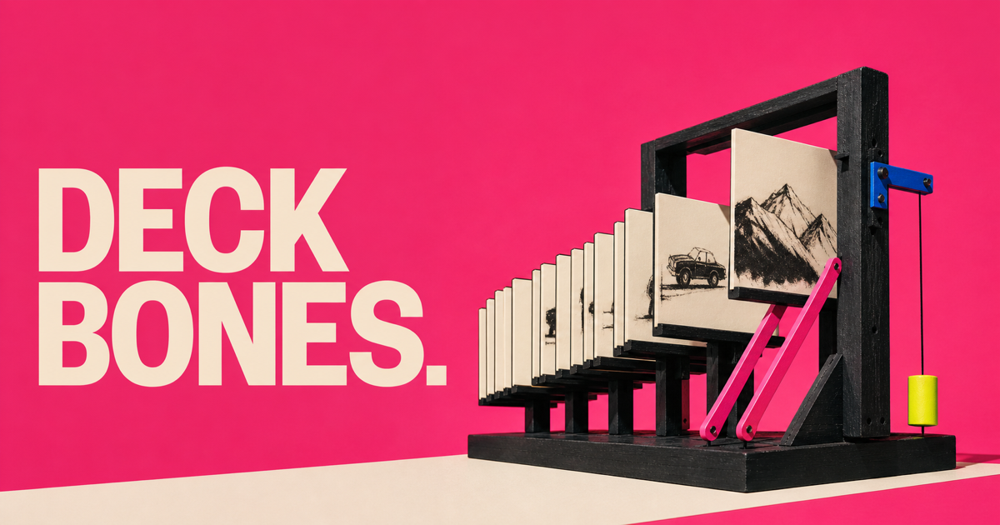
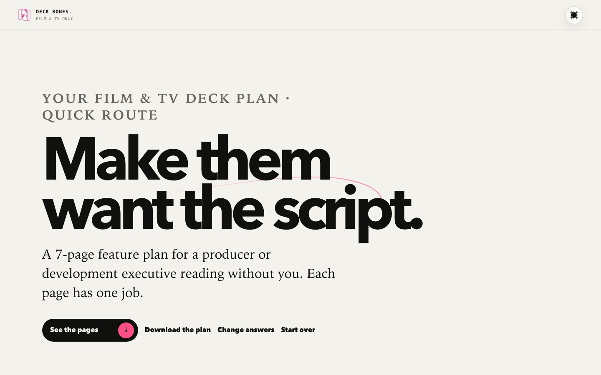

<p align="center">
  
</p>

# Deck Bones

**Bold choices in. A useful Film & TV deck structure out.**

Deck Bones turns a handful of structured decisions into a page-by-page plan for a scripted feature or series deck. No blank boxes. No universal template pretending every reader wants the same thing.

[](https://github.com/bomkino/pitchdog-deck-bones/actions/workflows/ci.yml)

<p align="center">
  
</p>

## Two ways through

- **Quick plan:** 45 seconds, usually 5–6 bold choices.
- **Expert plan:** explicit opt-in, up to 21 questions and more than 90 structured options covering stage, recipient, route, format, attachments, evidence, rights, finance, authorship, access, and delivery.

Both routes produce the same kind of inspectable result: what comes first, what belongs in the deck, what can be parked, and why.

## Film & TV only

Deck Bones is deliberately narrow. It plans decks for scripted features and series. Advertising, startups, education, and other pitch situations belong in different tools because their evidence, labor, readers, and decisions differ.

## No typing theater

Every input is a choice the decision tree can use. The tool does not ask you to write prose it cannot understand. It does not write your deck or invent facts. It gives the work a spine.

All state stays in the browser. No runtime AI, account, database, analytics, upload, or email gate.

## Run and verify

Requires Node.js 22.18 or newer.

```bash
npm install
npm run dev
npm run verify
```

`npm run verify` runs TypeScript checks, product tests, the production build, and hosting-contract tests.

## How it is built

- `src/content.ts` — quick and expert decision trees
- `src/plan.ts` — deterministic section, prerequisite, and rationale logic
- `src/main.ts` — journey, progress, result, and 16:9 page rail
- `src/ui.ts` / `src/base.css` — accessible shell, theme, cursor, and scroll discipline
- `tests/` — route, plan, and hosting contracts
- `docs/PRODUCT-CONTRACT.md` — promises, assumptions, and boundaries

## Contributing and reuse

Read [CONTRIBUTING.md](CONTRIBUTING.md), [CODE_OF_CONDUCT.md](CODE_OF_CONDUCT.md), and [SECURITY.md](SECURITY.md).

Software and documentation: [AGPL-3.0-or-later](LICENSE). Original visual assets: [CC BY-SA 4.0](ASSET-LICENSE.md). The pitch.dog name and logo remain subject to [TRADEMARKS.md](TRADEMARKS.md).
